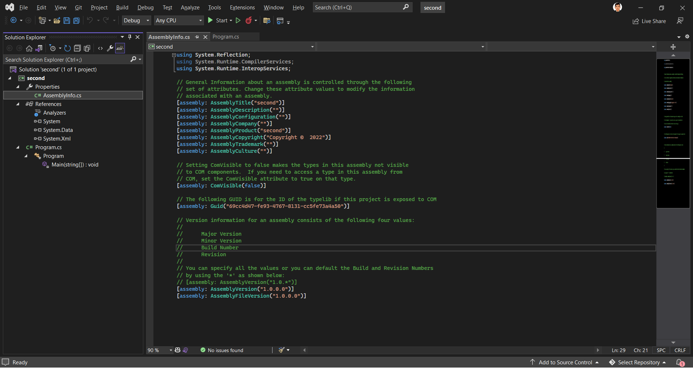
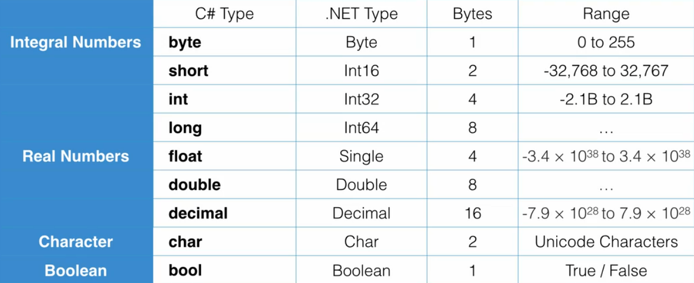

# Introduction to C# and .NET 

C# is a programming language. Before C#, there were two languages in the C family - C and C++. With either of C/C++ languages, when we compile our application - the compiler translates our code into the native machine code.  
With languages like Java, the compilation outputs into an intermediate bytecode. With this theory, our compiled output would not be dependent on the hardware.  
And, C# has the same technique. When we compile C# source code, it translates into **IL** code which stands for *Intermediate Language*.  
But now we need something that translates the IL code, into the native language that can run on the machine. And that is the job of CLR. So, CLR is essentially an application that translates IL code into machine code by **JIT**ting.  

.NET is a framework for building applications on Windows. This framework is not limited to C#. There are many languages that can target .NET framework and build applications with it.  
The .NET framework consists of two main components. 
1. CLR - Common Language Runtime 
2. Class Library 

# Application Architecture 

At very high level, the architecture of a C# application consists of classes. A class is a container that can hold some data - which is also called attributes, and functions which is also called methods.  
These functions/methods add behavior by execution/doing-things for us.  
Data represents the state of the application.  

As the number of classes in our application grows, we need a way to organize these classes. That's why we need **namespaces**. A namespace is a container for related classes.  
In a real-world application, as these namespaces grow - we need another way of partitioning our application. That's where we use an **Assembly**. An assembly is a container for related namespaces. Physically, it's a file on the disk - which can either be an executable (EXE) or a dynamicaly linked library (DLL). So, when we compile an application - the compiler will build one or more assemblies depending on how we partition our code. 

# The Visual Studio IDE 

VS is highly recommended for C# developing.  

  

In its solution explorer, You will be able to see `AssemblyInfo.cs` file. It contains all the information for an assembly that can be created with your project. If you ever think of distributing an assembly, you should probably fill all the details in there.  

<details>
<summary><code>AssemblyInfo.cs</code></summary>

```cs
using System.Reflection;
using System.Runtime.CompilerServices;
using System.Runtime.InteropServices;

// General Information about an assembly is controlled through the following
// set of attributes. Change these attribute values to modify the information
// associated with an assembly.
[assembly: AssemblyTitle("MyApplication")]
[assembly: AssemblyDescription("")]
[assembly: AssemblyConfiguration("")]
[assembly: AssemblyCompany("")]
[assembly: AssemblyProduct("MyApplication")]
[assembly: AssemblyCopyright("Copyright ©  2022")]
[assembly: AssemblyTrademark("")]
[assembly: AssemblyCulture("")]

// Setting ComVisible to false makes the types in this assembly not visible
// to COM components.  If you need to access a type in this assembly from
// COM, set the ComVisible attribute to true on that type.
[assembly: ComVisible(false)]

// The following GUID is for the ID of the typelib if this project is exposed to COM
[assembly: Guid("69cc4d47-fe93-4767-8131-cc5fe73a4a50")]

// Version information for an assembly consists of the following four values:
//
//      Major Version
//      Minor Version
//      Build Number
//      Revision
//
// You can specify all the values or you can default the Build and Revision Numbers
// by using the '*' as shown below:
// [assembly: AssemblyVersion("1.0.*")]
[assembly: AssemblyVersion("1.0.0.0")]
[assembly: AssemblyFileVersion("1.0.0.0")]
```

</details>

All these attributes are for assembly identification or assembly manifest. 

Under references tab, you will be able to see any assemblies that the project is referencing.  

There will be an `App.config` XML file where the application's configurations will be saved. Sometimes, you might want to save connection strings to a database or you might want to save some settings for the application. All that should be end up here.  

There is also an **Object Browser** in VS. We can use it to look at various namespace and their member definitions in our project or in any library-framework we're using. 

# Basic C# 

We write classes for our application in some namespace. If we want to use classes from other namespaces in our application - we can use the `using` keyword to refer to them. 

```cs
using System;

namespace MyApplication
{
    internal class Program
    {
        static void Main(string[] args)
        {
        	Console.WriteLine("Hello, World!");
        }
    }
}
``` 

The class `Console` can be used to read data from the console or to write data to it. 

# Variables & Data Types 

  

Each C# types maps to their corresponding .Net types. When we compile our application, the compiler will convert our C# types into their equivalent .NET types.  

Double is the default floating point data type in C#. If we want a float or a decimal, we need to explicitly tell the compiler that by post-fixing the value with `f` or `m`.  

C# don't have overflow checking. If we increment a number out of its type range at runtime, it will overflow. For example, if we increment a `byte` variable's value from 255 to 255+1, it's final value would be set to 0.  
If we don't want overflowing to happen, we need to use the `checked` keyword and enclose our operation within a block. In that case, the value will not overflow, instead it will throw an exception. 

```cs
checked 
{
	byte number = 255;
	number = number + 1;
}
```

<br /> 

There is a `var` keyword in C#. Instead of explicitly specifying the data type, we can use this keyword. 

We can use **format strings** in C# for easier console outputs. 
```cs
Console.WriteLine("Byte Min:{0} and Max:{1}", byte.MinValue, byte.MaxValue);
```

We can declare constant values using `const` keyword. This keyword comes before the data type. 

## Type Conversion 

There are times that you need to temporarily convert the value of a variable to a different type. Note that this conversion does not impact the original variable since C# is a statically-typed language, which in simple term means: *once you declare the type of a variable, you cannot change it*. But you may need to convert the "value" of a variable as part of assigning that value to a variable of a different type.  

There are a few conversion scenarios: 
* If types are compatible (e.g. integral numbers and real numbers) and the target type is bigger, you don't need to do anything. The value will be automatically converted by the runtime and stored in the target type.
```cs
byte b = 1;
int i = b;
```
Here because b is a byte and takes only 1 byte of memory, we can easily convert it to an int, which takes 4 bytes. So we don't need to do anything. 
* If the target type, however, is smaller than the source type, the compiler will generate an error. The reason for that is that overflow may happen as part of the conversion. For example, if you have an int with the value 1000, you cannot store it in a byte because the max value a byte can store is 255. In this case, some of the bits will be lost in memory. And that's the reason compiler warns you about these scenarios. If you're sure that no bits will be lost as part of the conversion, you can tell the compiler that you're aware of the overflow and would still like the conversion to
happen. In this case, you use a cast:
```cs
int i = 1;
byte b = (byte)i;
```
In this example, our int holds the value 1, which can perfectly be stored in a byte. So, we use a cast to tell the compiler to ignore the overflow. A cast means prefixing the variable with the target type. So here we are casting the variable i to a byte in the second line.
* Finally, if the source and target type are not compatible (eg a string and a number), you need to use the Convert class.
```cs
string s = “1234”;
int i = Convert.ToInt32(s);
```

**Convert** class has a number of methods for converting values to various types. `ToByte()`, `ToInt16()`, `ToInt32()`,`ToInt64()`.  
All primitive types have `Parse()` methods. 
```cs
string s = "1";
int i = Convert.ToInt32(s);
int j = int.Parse(s);
```

```cs
try 
{
	var number = "1234";
	byte b = Convert.ToByte(number);
	Console.WriteLine(b);
}
catch (Exception)
{
	Console.WriteLine("The number could not be converted to byte.");
}
```

# Classes 

Classes are building blocks of our applications. A class combines related variables (also called fields, attributes or properties) and functions (methods) together.  
Note: fields and properties are technically different in C# but conceptually they mean the same thing. They represent attributes about a class.  
An object is an instance of a class. At runtime, many objects collaborate with each other to provide some functionality. 
Note that even though there is a slight different between the word Class and Object, these words are often used interchangeably.  
To create a class:
```cs
public class Person
{
	public string Name;

	public void Introduce()
	{
		Console.WriteLine(“My name is “ + Name);
	}
}
```

Here, public is what we call an access modifier. It determines whether a class is visible to other classes or not.  
Here void means this method does not return a value.  
To create an object, we use the new operator:
```cs
Person person = new Person();
```
A cleaner way of writing the same code is:
```cs
var person = new Person();
```

We use the new operator to allocate memory to an object. In C# you don’t have to worry about de-allocating the memory. CLR has a component called Garbage Collector, which automatically removes unused objects from memory. 

## The Static Modifier 

When applied to a class member (field or method), makes that member accessible only via the class, not any objects.  
We use static members in situations where we want only one instance of that member to exist in memory. As an example, the Main method in every program is declared as static, because we need only one entry point to the application.  
In the real-world, it’s best to stay away from static as much as you can because that makes writing automated tests for applications hard. 

# Structs 

A struct (structure) is a type similar to a class. It combines related fields and methods together.
```cs
public struct RgbColor
{
	public int Red;
	public int Green;
	public int Blue;
}
```
Use structs only when creating small lightweight objects. That is for a subtle performance optimization. In the real-world, 99% of the time, you create new types using classes, not structures.  
In .NET, all primitive types are declared as a structure. They are small and lightweight. The biggest primitive type doesn’t take more than 16 bytes. 

# Arrays 

An array is a data structure that is used to store a collection of variables of the same type. For example, instead of declaring three int variables (that are related), we can create an int array like this:
```cs
int[] numbers = new int[3];
```

An array in C# is actually an instance of the Array class. So, that’s why here we have to use the new operator to allocate memory to this object.  
Here, the number 3 specifies the size of the array. Once an array is created, its size cannot be changed. If you need a list with dynamic size, you need to use the List class.  
To access elements in an array, we use the square bracket notation:
```cs
numbers[0] = 1;
```

Note that in C# arrays are zero-indexed. So the first element has index 0.


